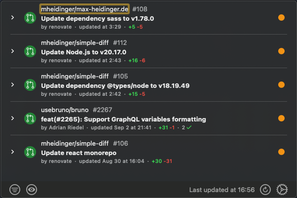
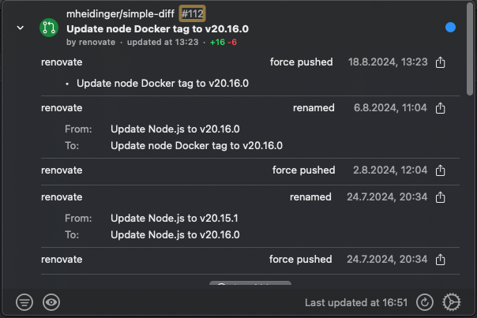

 

# PReek

PReek brings a quick peek into relevant GitHub Pull Requests directly into your MacOS MenuBar!

 
 

## Install

### Direct Download

A signed and notarized DMG installer can be found in the the [latest release](https://github.com/mheidinger/PReek/releases/latest).

### Brew - Coming Soon

Installation through Brew will come as soon as the project got some [popularity required for Brew](https://docs.brew.sh/Acceptable-Casks#rejected-casks), so feel free to ⭐ this repository!

### App Store - Maybe Coming Soon

Depending on the success of the project I'll decide whether it is worth the effort to publish to the App Store or not.

## FAQ

### Why is the notification scope required for the GitHub PAT?

PReek shows Pull Requests for which you got notifications for.
To be able to fetch your notifications, the notifications scope is required.

### Why is a given Pull Request not shown?

As PReek shows Pull Requests for which you got notifications for, please check whether you received a notification for the missing Pull Request in the [Notifications Inbox](https://github.com/notifications).
If you did not get a notification, verify that you have not disabled them for a given repository.
See the [GitHub documentation](https://docs.github.com/en/account-and-profile/managing-subscriptions-and-notifications-on-github/setting-up-notifications/configuring-notifications) for more information.

Additionally check if the repository it private / internal and if yes, whether you granted the repo scope to the GitHub PAT.
This scope is required to be able to access private repositories.
